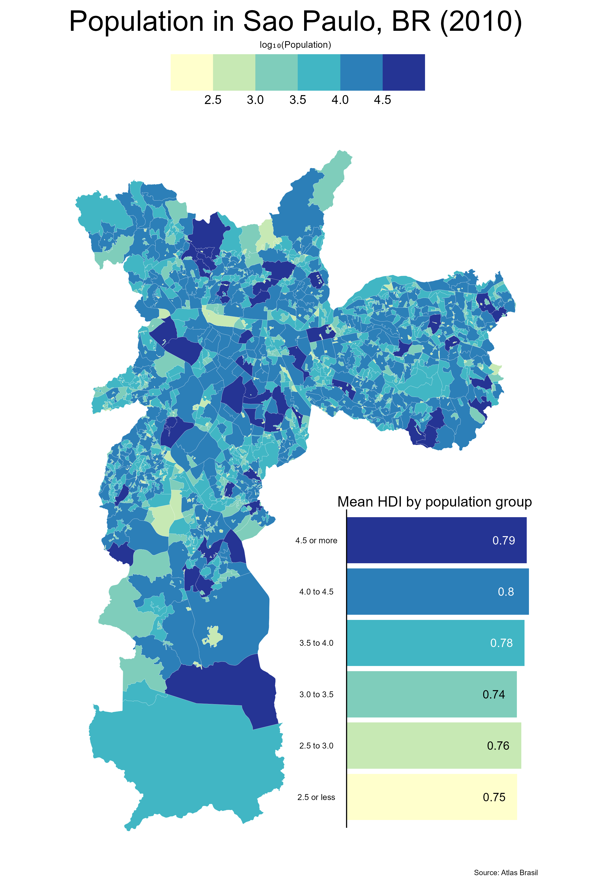

```{r}
#| include: false
library(ggplot2)
library(ggthemes)
library(patchwork)
library(dplyr)
library(readr)
library(sf)
```

```{r}
# read in data
atlas <- readr::read_rds(
  "https://github.com/viniciusoike/restateinsight/raw/main/static/data/atlas_sp_hdi.rds"
)

# Final map:

pmap <- ggplot(atlas) +
  geom_sf(aes(fill = (log10(pop))), lwd = 0.05, color = "white") +
  scale_fill_fermenter(
    name = "",
    breaks = seq(2.5, 4.5, 0.5),
    direction = 1,
    palette = "YlGnBu"
  ) +
  labs(
    title = "Population in Sao Paulo, BR (2010)",
    subtitle = "log\u2081\u2080(Population)",
    caption = "Source: Atlas Brasil"
  ) +
  theme_map() +
  theme(
    # Legend
    legend.position = "top",
    legend.justification = 0.5,
    legend.key.size = unit(1.25, "cm"),
    legend.key.width = unit(1.75, "cm"),
    legend.text = element_text(size = 12),
    legend.margin = margin(),
    # Increase size and horizontal alignment of the both the title and subtitle
    plot.title = element_text(size = 28, hjust = 0.5),
    plot.subtitle = element_text(hjust = 0.5)
  )

# Calculate population share in each HDI group
mean_hdi_pop <- atlas |> 
  st_drop_geometry() |>
  mutate(
    group_pop = findInterval(log10(pop), 
                             seq(2.5, 4.5, 0.5), 
                             left.open = FALSE),
    group_pop = factor(group_pop)
  ) |> 
  group_by(group_pop) |> 
  summarise(mean_hdi = mean(HDI, na.rm = TRUE)) |> 
  ungroup() |> 
  na.omit()

# Create a variable to store the position of the text label
mean_hdi_pop <- mean_hdi_pop |> 
  mutate(
    y_text = mean_hdi - .1,
    label = paste0(round(mean_hdi, 2))
  )

# Final bar chart
# Labels for the color legend
x_labels <- c(
  "2.5 or less", "2.5 to 3.0", "3.0 to 3.5", 
  "3.5 to 4.0", "4.0 to 4.5", "4.5 or more"
)

pcol <- ggplot(mean_hdi_pop, aes(group_pop, mean_hdi, fill = group_pop)) +
  geom_col() +
  geom_hline(yintercept = 0) +
  geom_text(
    aes(y = y_text, label = label, color = group_pop),
    size = 4
  ) +
  coord_flip() +
  scale_x_discrete(labels = x_labels) +
  scale_fill_brewer(palette = "YlGnBu") +
  scale_color_manual(values = c(rep("black", 3), rep("white", 3))) +
  guides(fill = "none", color = "none") +
  labs(
    title = "Mean HDI by population group",
    x = NULL,
    y = NULL
  ) +
  theme_void() +
  theme(
    panel.grid = element_blank(),
    plot.title = element_text(size = 14),
    axis.text.y = element_text(size = 8),
    axis.text.x = element_blank()
  )

# Putting it together with patchwork::inset_element
p_pop_atlas <- 
  pmap + inset_element(pcol, left = 0.5, bottom = 0.05, right = 1, top = 0.5)

ggsave("hdi_chloropleth_with_barchart.png", 
       width = 8, height = 12, units = "in")

```




### Summary of Changes:

The first thing I did was include only the necessary code to make the plot. This includes running the packages, reading the data, the final map, the needed code to make the bar chart, the code for the final bar chart, and the code for putting them together/saving the plot as a png. Then, I fixed the titles and subtitles. I figured out `\u2081\u2080` makes a subscript 10 when it renders. I then worked on the map by changing the variable assigned to `fill` and where the breaks were. Next, I worked on changing the data frame the bar chart uses, and made new variables. With trial and error, I then lined up the y_text accordingly and changed the color of the numbers. Finally, I added `` so it displays the image file rather than the code chunk version of the plot.  


